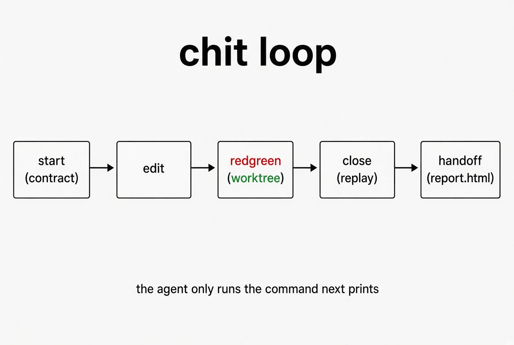
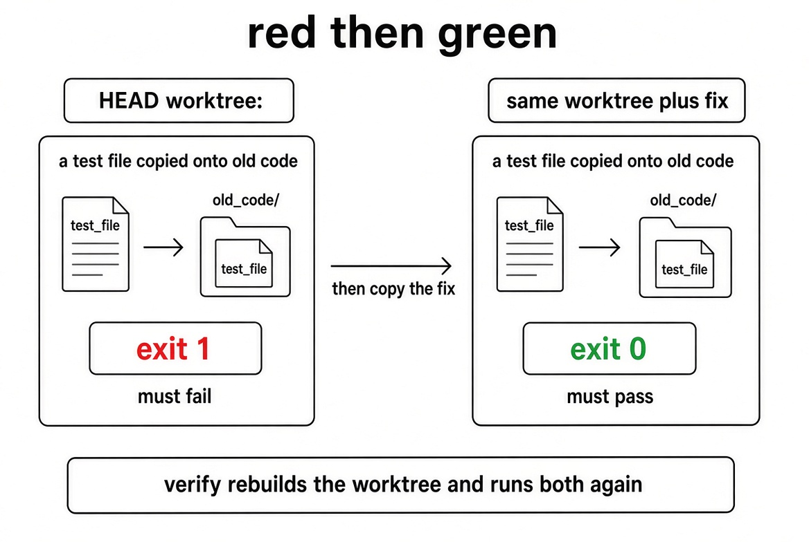
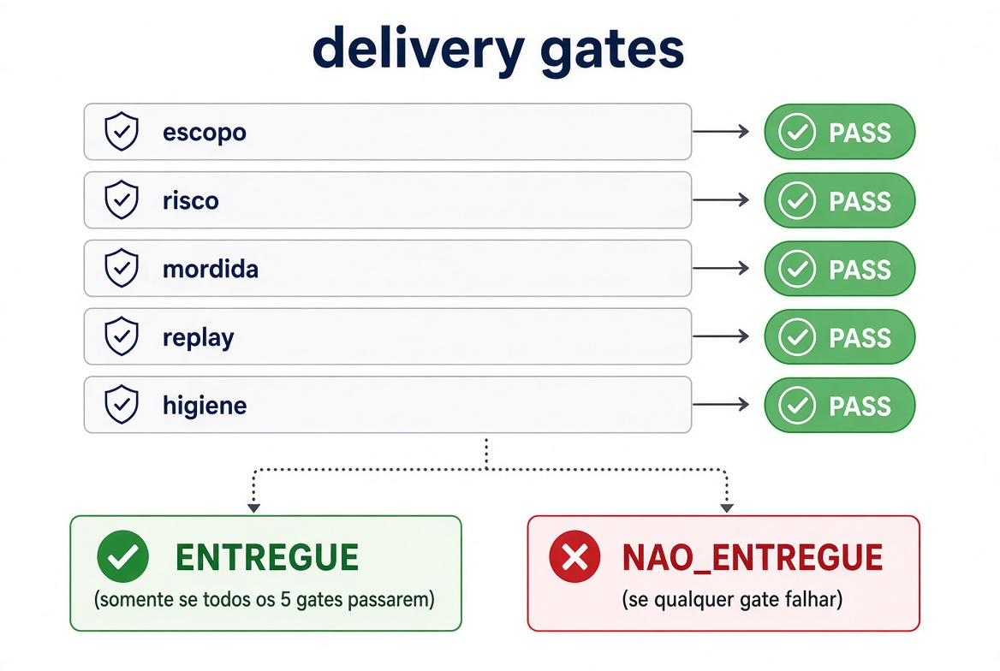

# chit

The test bites, or it did not ship.

A coding agent will say the tests passed. Chit does not take that sentence. A detached worktree at `HEAD` runs the test, the fix is applied, the same command runs again, and a second worktree replays both. The user gets `.chit/report.html`. `ENTREGUE` is a gate result, not a summary.



## The failure this is for

The bug is not the model. Claude Code, Codex, Antigravity, and Copilot agent mode all do the same thing: edit, claim green, lose the evidence in scrollback. A stronger model still does it. The fence has to sit outside the model.

Chit is that fence. `next` prints one command. The agent runs that string. The script writes the verdict.

## What is proved

For a T1 or T2 change, delivery means all of the following held on this patch:

1. A contract existed before the edit: one locked sentence, a non-goal, the exact test command, and an oracle string.
2. On a worktree at `HEAD`, that command exited non-zero, and the output contained the oracle.
3. After the fix was copied in, the same command exited 0.
4. A second worktree at the same base repeated both results (`CONFIRMED`).
5. The smell scan found no block-level finding (new dependency, `TODO`, empty catch, `as any`).

If red and green produce the same output hash, the verdict is `ENV_FAIL`. The tool did not run. That is not a fix. If red fails without printing the oracle, the verdict is `WRONG_BITE`. The test did not encode the ask.



## What is not proved

Chit does not find bugs nobody wrote a test for. A line-level review harness is a different product. Chit also does not prove the oracle is the right product behavior. It proves this command discriminates `HEAD` from the patch, and that the failing output names the taste the contract asked for. A human still reads the assertion.

Test and fix in the same file are refused. Red cannot be isolated. A repo with no commit cannot be graded.

## Gates

Close writes the page only after five gates. All five must be `PASS`.

| Gate | Pass |
|---|---|
| escopo | Locked sentence and non-goal are on the contract. |
| risco | T2 named a rollback before the edit. T3 does not close. |
| mordida | Red exit is non-zero, green exit is 0, red output contains the oracle. |
| replay | Verify rebuilt the worktree and agreed. |
| higiene | Smell scan has no block. |



T0 is copy only. It may close without a bite. T3 (migration, backfill, incompatible schema) stops. Split it into expand, backfill, switch.

## Run

The agent runs `next` and executes `do`. Nothing else, except the edit itself.

```bash
python3 scripts/chit.py next --repo . --label filter
python3 scripts/chit.py start --repo . --label filter --tier T1 \
  --locked "end is exclusive" --nongoal "do not touch the UI" \
  --test "python3 orders/filter_test.py" --oracle "end exclusive"
python3 scripts/chit.py redgreen --repo . --label filter -- python3 orders/filter_test.py
python3 scripts/chit.py close --repo . --label filter
```

`handoff` is the end. The path is `.chit/report.html`. Add `.chit/` to `.gitignore`.

The failing test has to print the oracle. An exit with no taste is `WRONG_BITE` and does not deliver.

```python
if in_range(10, 1, 10) is not False:
    print("end exclusive")
    sys.exit(1)
```

## Verdicts

| Verdict | Meaning |
|---|---|
| `BITES` | Old code fails with the oracle. Patch passes. Not delivery yet. |
| `WRONG_BITE` | Red failed, oracle absent. Fix the test, not the claim. |
| `DOES_NOT_BITE` | Test passed on `HEAD`. |
| `STILL_RED` | Fix did not turn the test green. |
| `ENV_FAIL` | Red and green failed the same way. Tooling, not the patch. |
| `CONFIRMED` | Replay agreed. |
| `ENTREGUE` | All gates passed. This is the handoff. |
| `NAO_ENTREGUE` | The page was written and delivery was refused. |

## Install

Copy this folder. Keep `scripts/`. A `SKILL.md` without the script is a prompt, and these agents already ignore prompts.

| Agent | Path |
|---|---|
| Claude Code | `.claude/skills/chit` or `~/.claude/skills/chit` |
| Codex | `.codex/skills/chit` or `~/.codex/skills/chit` |
| Antigravity | `.agents/skills/chit` |
| VS Code Copilot, agent mode | `.github/skills/chit` |

Needs git, Python 3, and a shell. The free Copilot tier has no agent mode, so the skill will not fire there.

## What was run

Two scripted sessions, each allowed only to execute the command `next` printed.

The good session printed `end exclusive` on failure. Route was `redgreen`, then `close`, then `handoff`. Panel all `PASS`. Red cause on the page was the oracle. Verify was `CONFIRMED`.

The bad session exited 1 without the oracle. Six turns, every one `WRONG_BITE`. No report.

That is a scripted obedient agent, not a live IDE session. Treat the live session as still open.

## Design choices

The model picks the command. The script picks the verdict. That split is the whole design. Five reviewer personas in a prompt still lie in chorus. Gates do not.

Replay exists because a receipt the agent writes can be typed. A second worktree cannot be paraphrased. File hashes in the receipt make a later edit `STALE`.

Oracle-in-the-red-output is the cheapest bind between the ask and the bite. It does not read the assertion and decide it matches the product. It stops the empty `sys.exit(1)`.
